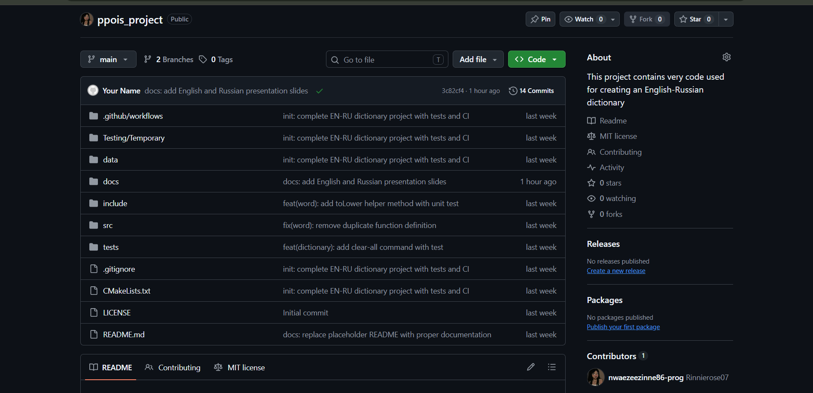
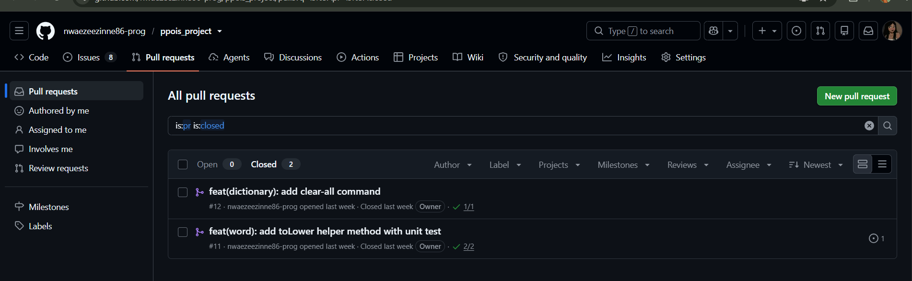
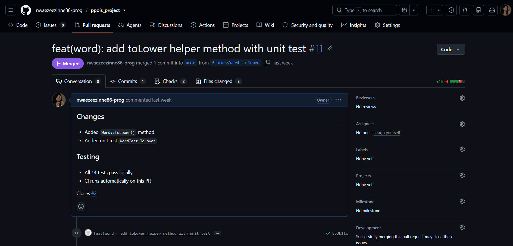
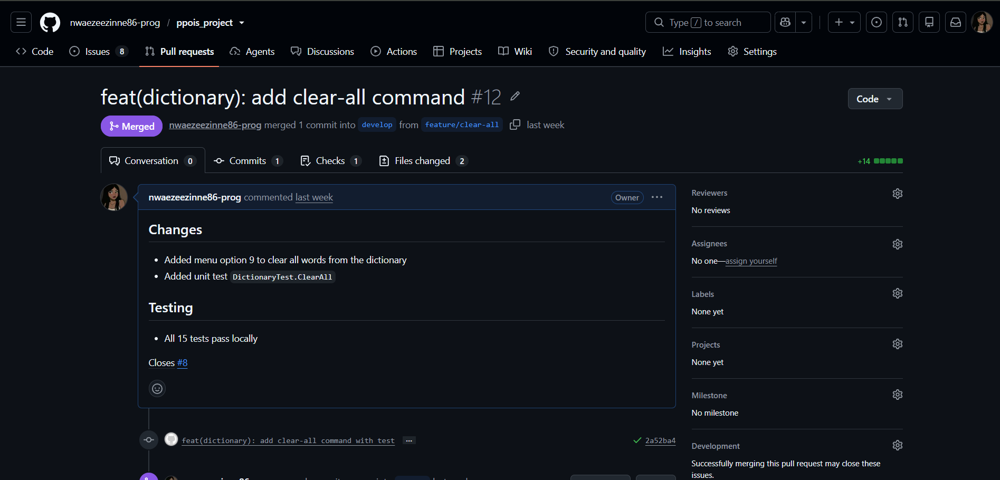
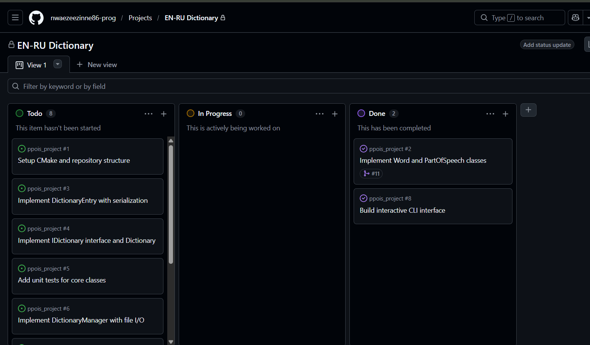
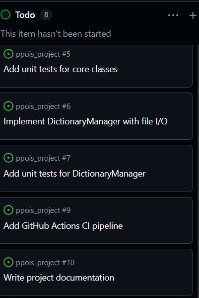
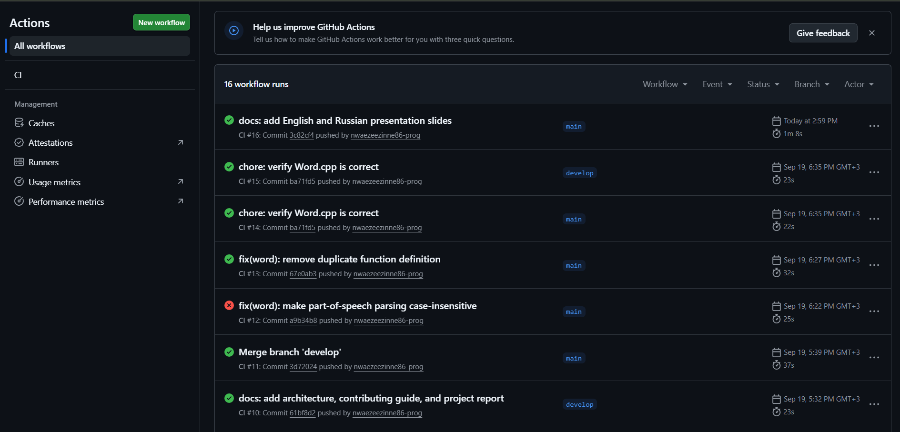
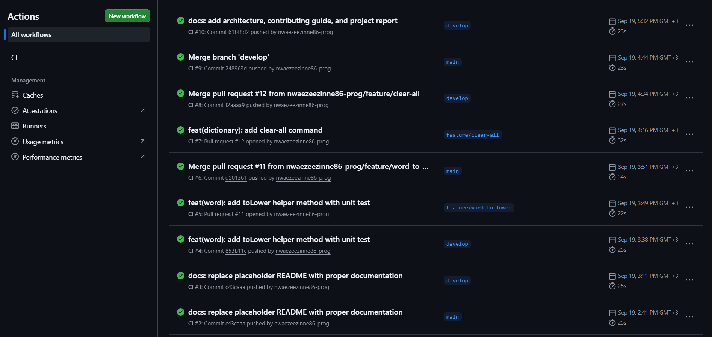

# Project Report: English-Russian Dictionary

**Author:** nwaezeezinne86-prog
**Course:** PPOIS
**Date:** September 2026

## 1. Introduction

A command-line English-Russian dictionary in modern C++17.
Demonstrates OOP (inheritance, polymorphism), templates, STL,
and a professional GitHub workflow.

## 2. Functional Requirements

- Add words with multiple Russian translations
- Search English → Russian and Russian → English
- Remove entries
- Save/load to file
- Display word count

## 3. Non-functional Requirements

- C++17
- CMake build system
- Unit tests (GoogleTest)
- Continuous Integration (GitHub Actions)
- Markdown documentation

## 4. Architecture

See ARCHITECTURE.md. Layers:

- **main.cpp** — CLI
- **DictionaryManager** — orchestration, I/O
- **IDictionary / Dictionary** — business logic
- **Repository<T>** — generic storage
- **Word / DictionaryEntry** — value objects

## 5. Technology Choices

| Choice | Reason |
|---|---|
| C++17 | Required; enables structured bindings, std::optional |
| CMake | Cross-platform, industry standard |
| GoogleTest | De-facto C++ test framework |
| GitHub Actions | Free, GitHub-integrated CI |
| SSH keys | Secure, password-less Git |

## 6. Testing

- **Framework:** GoogleTest
- **Suites:** WordTest, DictionaryTest, ManagerTest
- **Tests:** 13 total, all passing
- **CI:** runs on every push and pull request

## 7. Git Workflow

- `main` — stable, protected
- `develop` — integration
- `feature/*` — short-lived feature branches
- Every change merged via Pull Request
- Conventional commit messages

Evidence on GitHub:
- **PR #11** — `feature/word-to-lower` → merged to main
- **PR #12** — `feature/clear-all` → merged to develop

## 8. Metrics

| Metric | Value |
|---|---|
| Source files | 11 |
| Lines of code | ~900 |
| Unit tests | 13 |
| Pull requests | 2 |
| Issues | 10 |
| CI runs | on every push |

## 9. Lessons Learned

- Interface-first design simplifies testing
- Small PRs are easier to review
- CI catches issues early
- Documentation lives best next to code

## 10. Future Work

- Qt GUI
- SQLite persistence
- Speech synthesis
- Web API

## Appendix — Build Instructions

```bash
git clone git@github.com:nwaezeezinne86-prog/ppois_project.git
cd ppois_project
cmake -S . -B build
cmake --build build -j
cd build && ctest --output-on-failure
./dictionary_app

## Appendix C — Screenshots

Visual evidence of the project's development history and results.

### Repository Structure


### Issues and Task Tracking


### Merged Pull Requests




### Project Board


### Continuous Integration


### Test Results


### Application Demo

